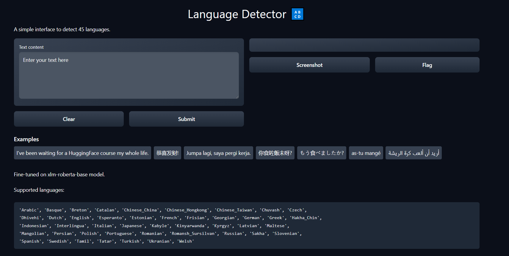

# Language Detector

This app used pretrained [xlm-roberta-base](https://huggingface.co/xlm-roberta-base) model and fine-tuned on the
[common_language](https://huggingface.co/datasets/common_language) dataset under PyTorch and HuggingFace framework. It can detect 45 languages based on user text input and is hosted on HuggingFace space platform.

## Fine-tuned Model

Download: [language-detection-fine-tuned-on-xlm-roberta-base](https://huggingface.co/ivanlau/language-detection-fine-tuned-on-xlm-roberta-base)

## Demo

Try it out: [language detector](https://huggingface.co/spaces/ivanlau/language-detection-xlm-roberta-base)

## Files Description

- `hf_demo`
  - repo for HuggingFace space app demo

- `datset`
  - folder where train and test dataset will be downloaded to.

- `xlm_roberta_base_commonlanguage_language_detector.ipynb`
  - notebook for fine-tuning xlm-roberta-base model
